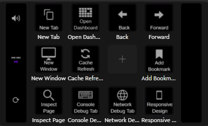

# loupedeck-profiles

Sharing my Loupedeck Profiles I have created for others to use if desired and to share the love and effort I've done is setting up my config. I am welcome to any suggestions and improvements. **NOTE: Profiles and Software Used is all Windows Based**

# How to use

Below you should find a list of profiles I have provided. Further below you should hopefully see screenshots of the default setup of the profiles I have provided.

To use: find and download the appropriatly named `.lp5` Loupedeck Profile files in the `/profiles` folder. Once downloaded in Loupedeck software click on the profile menu in the top header section. Select "Import profile" option. Browse to and select the download profile file and click "Import". Select the appropriate application (hopefully already selected, otherwise verify the correct application is selected), provide and name and click "Ok".

# List of profiles

- Bitwarden Desktop App
- Firefox
  - Note: Will want to update "Dashboard" Url in step 2 of multi-step action.

# Screenshots

- Bitwarden
  - 
- Firefox
  - 

# Buy me a Coffee

If you have found these profiles helpful and maybe saved you some time. Please consider clicking the image below to buy me a coffee or two. You generosity will help keep me caffeinated and encourage me to keep these updated.

